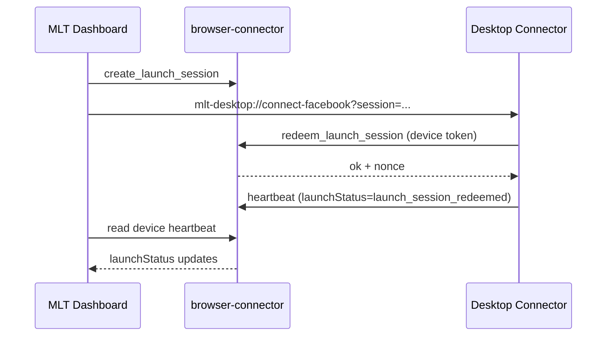

# Launch session contract (MLT Dashboard ↔ Desktop Connector)

This document defines the **dashboard-initiated deep link** flow for opening the MLT Desktop Connector and connecting Facebook without exposing secrets in URLs.

## URL protocol

Registered custom scheme: `mlt-desktop://`

| Route | Example | Desktop behavior |
|---|---|---|
| `open` | `mlt-desktop://open` | Focus connector window |
| `connect-facebook` | `mlt-desktop://connect-facebook?session=<opaque-id>` | Redeem launch session, launch browser, guide Facebook login or verify Marketplace readiness |
| `open-messenger` | `mlt-desktop://open-messenger?session=<opaque-id>` | Redeem launch session, open Facebook Messenger, ack `ready` / heartbeat `messenger_ready` |
| `open-marketplace` | `mlt-desktop://open-marketplace` | Launch browser and open Marketplace |
| `open-vehicle-create` | `mlt-desktop://open-vehicle-create` | Launch browser and open vehicle create form |
| `pair` | `mlt-desktop://pair?session=<opaque-id>` | Auto-pair when unpaired (no display code) |
| `connect-facebook` (unpaired) | `mlt-desktop://connect-facebook?session=<opaque-id>` | Auto-pair via `pair_from_launch_session`, then open Facebook |

The `session` query parameter is an **opaque one-time id** (alphanumeric, `-`, `_`, max 128 chars). Never put JWTs, Neon tokens, or Supabase keys in URLs.

**Product rule:** Dealers never enter a pairing code. Login → Connect → deep-link session → automatic pair.

## Backend action: `pair_from_launch_session`

**Endpoint:** `browser-connector` (POST) — unpaired Desktop Connector only

**Auth:** none (session id is the capability; short TTL + one-time redeem)

### Request

```json
{
  "action": "pair_from_launch_session",
  "sessionId": "<opaque-launch-session-id>",
  "deviceId": "<connector-device-uuid>",
  "connectorVersion": "1.0.7",
  "os": "macos",
  "capabilities": ["facebook_marketplace_posting"]
}
```

### Success response

```json
{
  "ok": true,
  "status": "pairing_completed",
  "accessToken": "...",
  "refreshToken": "...",
  "userId": "...",
  "dealershipId": "...",
  "intent": "connect_facebook",
  "deviceId": "..."
}
```

Marks the launch session redeemed and issues device tokens. No pairing code.

## Backend action: `redeem_launch_session`

**Endpoint:** existing `browser-connector` edge function (POST)

**Auth:** `x-connector-device-token` (paired device access token) + Supabase anon key headers

### Request

```json
{
  "action": "redeem_launch_session",
  "sessionId": "<opaque-launch-session-id>",
  "deviceId": "<connector-device-uuid>"
}
```

### Success response

```json
{
  "ok": true,
  "nonce": "<single-use-nonce>",
  "expiresAt": "2026-07-27T17:05:00.000Z"
}
```

### Error responses

| `errorCode` | Meaning |
|---|---|
| `LAUNCH_SESSION_NOT_FOUND` | Unknown or expired session |
| `LAUNCH_SESSION_ALREADY_REDEEMED` | Replay attempt |
| `LAUNCH_SESSION_EXPIRED` | Past TTL (target 2–5 minutes) |
| `DEVICE_REVOKED` | Device no longer authorized |

## Security properties

1. **One-time use** — backend marks session redeemed; desktop persists redeemed `nonce`/`sessionId` locally to block replay.
2. **Short TTL** — sessions expire in 2–5 minutes.
3. **Paired device auth** — redemption requires valid device access token.
4. **No secrets in URLs** — only opaque session ids traverse the custom protocol.

## Heartbeat visibility (dashboard acknowledgement)

The connector reports launch progress on each heartbeat:

| Field | Example values |
|---|---|
| `launchSessionId` | opaque id from URL |
| `launchStatus` | `app_opened`, `launch_session_redeemed`, `launch_session_rejected`, `browser_ready`, `facebook_logged_in`, `facebook_login_required`, `marketplace_ready`, `messenger_ready`, `pairing_required`, `device_revoked`, `error` |

### Leads monitor handoff (`open-messenger`)

1. Dashboard creates launch session with `intent: "open_messenger"` (or `start_monitoring`).
2. Dashboard opens `mlt-desktop://open-messenger?session=<id>`.
3. Desktop redeems via `redeem_launch_session`, then calls `acknowledge_launch_session` with `state: launching|ready|error`.
4. Desktop opens Messenger (`open_messenger` sidecar RPC) and heartbeats `messenger_ready=true`, `messenger_state=messenger_ready`, `current_service` while the runtime holds the messenger service.
5. Dashboard polls launch status for `launch_acknowledged` + `ackState=ready`, and device status for Monitor open.

## Lovable implementation prompt (backend)

Implement in `mlt/supabase/functions/browser-connector/`:

1. Add `redeem_launch_session` action handler.
2. Dashboard creates a launch session row when user clicks **Connect Facebook on Desktop**:
   - Generate opaque `session_id` (UUID or similar).
   - Store `user_id`, `dealership_id`, `created_at`, `expires_at` (+2–5 min), `redeemed_at` null.
3. Redirect/open `mlt-desktop://connect-facebook?session=<session_id>`.
4. On redeem:
   - Validate device token → user/dealership match session.
   - Reject if expired or already redeemed.
   - Set `redeemed_at`, return `{ ok: true, nonce }`.
5. Dashboard polls device heartbeat for `launchStatus` transitions to show acknowledgement UI:
   - `app_opened` → connector focused
   - `launch_session_redeemed` → link verified
   - `browser_ready` / `facebook_logged_in` / `marketplace_ready` → progressive readiness

## App detection contract (dashboard)

Recommended acknowledgement sequence:



Until backend ships, the desktop client calls `redeem_launch_session` and surfaces a clear error while still opening the Facebook connection workflow locally.
